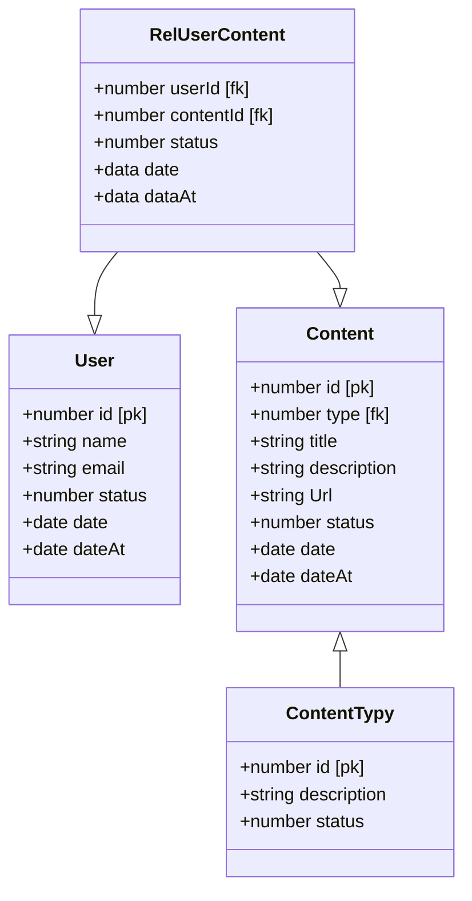

# Diagrama de Classes - GC

```mermaid
classDiagram

RelUserContent --|> User
RelUserContent --|> Content
Content <|--ContentTypy

class User {
    +number id [pk]
    +string name    
    +string email    
    +number status
    +date date
    +date dateAt
}

class Content {
    +number id [pk]    
    +number type    [fk]
    +string title
    +string description
    +string Url
    +number status
    +date date
    +date dateAt
}

class ContentTypy{
    +number id [pk]
    +string description
    +number status  
}

class RelUserContent{
     +number userId [fk]
     +number contentId [fk]
     +number status
     +data date
     +data dataAt
}


```
